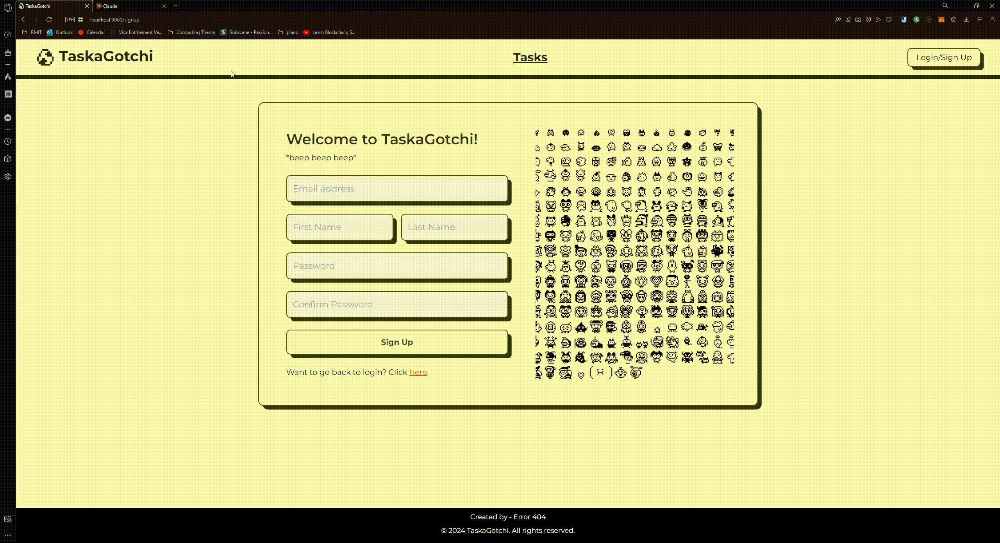

# Taskagotchi - README

Welcome to Taskagotchi, the retro-inspired virtual pet that's here to make your study sessions a blast! Developed by the talented team at 404 ERROR, consisting of Nguyen Anh Hoang, Amy Phung, and V, Taskagotchi combines the nostalgia of Tamagotchis with a powerful tool to help you stay on top of your deadlines and crush your goals.

## Getting Started

To start using Taskagotchi, follow these simple steps:

1. Clone the repository: `git clone https://github.com/aiimee/MACWebHack.git`
2. Navigate to the project directory: `cd taskagotchi`
3. Install the necessary dependencies: `npm install`
4. Start the application: `npm start`

## Features

- Adorable virtual pet that grows and evolves as you tackle your tasks
- Gamified task management system that turns your priorities into a game
- Earn rewards and experience points for completing important tasks
- Watch your pet transform from a cute critter to a super-smart sidekick

## Troubleshooting

If you encounter any issues or need to clear your local storage, follow these steps:

1. Open the developer tools in your browser (usually by pressing F12)
2. Navigate to the "Application" or "Storage" tab
3. Expand the "Local Storage" section
4. Find the entry for "taskagotchi" and delete it

## Demonstration

Here, you can include GIFs or screenshots demonstrating each page of the Taskagotchi application. Feel free to add them below:

## Demonstration Video

Check out this demo video of the Taskagotchi application (https://www.youtube.com/@onimmy):

[![Taskagotchi Demo]](https://www.youtube.com/@onimmy)

### Homepage

### Login Page

### Signup Page

### Task Creation

### Task Page

### Pet Evolution

## License

Taskagotchi is released under the [MIT License](https://opensource.org/licenses/MIT).

## Team Member

If you have any questions, suggestions, or feedback, please don't hesitate to reach out to the 404 ERROR team:

- Nguyen Anh Hoang: s3926822@rmit.edu.vn
- Amy Phung: [email protected]
- V: [email protected]

Happy studying and pet-raising with Taskagotchi!